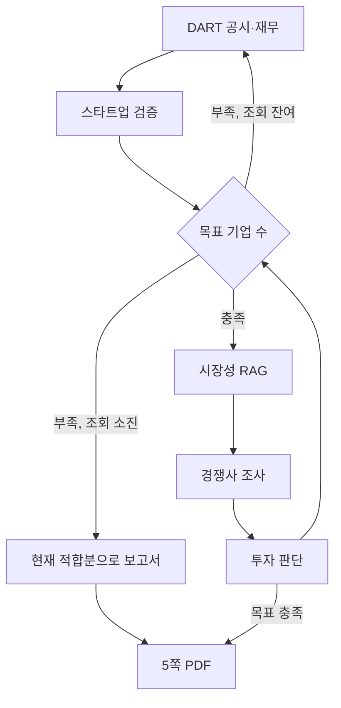

# AI Startup Investment Evaluation Agent

AI 데이터센터 전력·에너지 인프라 스타트업을, 공시와 시장 자료만으로 같은 기준에서 걸러 투자 적합 여부를 판단하는 실습 시스템입니다.

## Overview

- **목적**: 시장성, 재무(VBM), 경쟁 구도, 공시 실체를 한 흐름으로 대조해 투자 적합성만 남긴다
- **방법**: LangGraph 다중 에이전트, PDF 기반 Agentic RAG, DART 공시, 웹 보완 검색

평가 대상은 Series C 이하 비상장 에너지 기업입니다. 목표 수를 채우지 못하면 추가 조회를 멈추고, 그때까지 적합했던 기업만으로 보고서를 작성합니다.

## Features

- DART 기업개황·재무제표·감사보고서에서 실체와 재무를 확인
- 시장조사 PDF를 RAG로 검색하고, 관련 자료가 없으면 Research Nester 웹 보고서로 보완
- 외부 시장성 100점 만점, 하한 50점. VBM은 ROIC–WACC와 수익성·안정성·성장성으로 판정
- 경쟁사는 참고 정보로만 두고, 공시 없는 비교는 비교불가로 표시
- 인용은 기관 보고서·논문·웹페이지 형식으로 남김. 사용한 자료만 REFERENCE에 기입
- 산출물: `outputs/investment_report.pdf` (5쪽), `outputs/final_companies_latest.json`


## Tech Stack

- Framework: LangGraph
- LLM / Generator: GPT-4o-mini (스크리닝·경쟁사·보고서), GPT-4.1-mini (시장 요약)
- LLM / Judge: GPT-4o-mini (시장 질문 10항 채점)
- Retrieval: ChromaDB, Top-4, cosine distance 0.4 이내만 채택
- Embedding: BAAI/bge-m3

Hit Rate·MRR은 별도 벤치마크를 두지 않았습니다. 관련 없는 청크는 거리 기준으로 버리고 웹 자료로 대체합니다.

## Agents

- **DART**: 법인 식별, 개황, 재무, 감사보고서 PDF 수집
- **Screen**: 스타트업 여부·투자 단계 확인. Series C 초과는 제외
- **Market**: PDF RAG로 시장 규모·성장·수요를 정리. 미매칭 시 웹 서칭 보완
- **Competition**: 동일 산업 경쟁사와 제품·기술 차이를 정리
- **Judge**: 시장 점수와 VBM을 결합해 적합/부적합을 결정
- **Report**: 적합 기업만 정제해 5쪽 PDF로 배치


## Architecture




실행 시 LangGraph 연결도가 함께 출력됩니다.

## Directory Structure

```text
├── data/           # 시장조사 PDF 메타, 임베딩 원본
├── agents/         # DART · RAG · 경쟁사 · 판단 · 보고서
├── prompts/        # 단계별 프롬프트
├── outputs/        # JSON · PDF · 로그
├── app.py          # 전체 실행
└── README.md
```


## Usage

```bash
cp .env.example .env          # API 키 입력
python app.py                 # 기본 5개 기업 검색
```

필수 환경변수는 `.env.example`을 따릅니다. `DART_API_KEY`, `OPENAI_API_KEY`가 필요합니다.

## Contributors

- 신종민: 그래프 연결, , 단계 검증
- 이우성: DART 검색, PDF 전처리 설계
- 손민재: 시장조사 RAG, 기업 정보 추출
- 권태현: 경쟁사 비교, 투자 판단 외부 지표 설계
- 김가빈: 산출물 통합, 투자 보고서 제작

